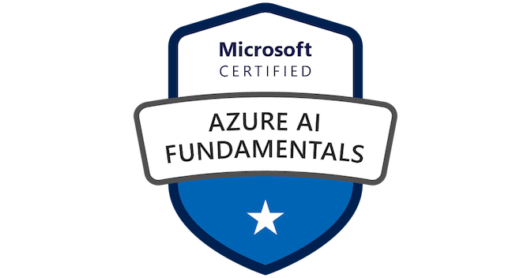

# Fundamentos de Inteligencia Artificial con Microsoft Azure

 

¡Bienvenidas y bienvenidos! En este repositorio encontrarán los contenidos para el curso *Fundamentos de Microsoft Azure AI* (AI-900) y los [módulos de aprendizaje autodirigido de Microsoft Learn](https://docs.microsoft.com/learn/certifications/azure-ai-fundamentals) Los laboratorios están pensados para complementar los materiales de aprendizaje y permiten practicar el uso de las tecnologías descritas en esta capacitación.

## Esquema del curso
### Módulo 1: Introducción a la Inteligencia Artificial en Azure
En este módulo, aprenderá sobre los usos comunes de la inteligencia artificial (IA) y los diferentes tipos de carga de trabajo asociados con la IA. Luego explorará consideraciones y principios para el desarrollo responsable de IA.

#### Lecciones
* Inteligencia artificial en Azure
* AI responsable

Después de completar este módulo, podrán:  
Describir las cargas de trabajo y las consideraciones de inteligencia artificial

### Módulo 2: Aprendizaje Automático
El aprendizaje automático es la base de las soluciones modernas de inteligencia artificial. En este módulo, aprenderá sobre algunos conceptos fundamentales de aprendizaje automático y cómo usar el servicio Azure Machine Learning para crear y publicar modelos de aprendizaje automático.

#### Lecciones
* Introducción al aprendizaje automático
* Aprendizaje automático Azure

Después de completar este módulo, podrán:   
Describir los principios fundamentales del aprendizaje automático en Azure

### Módulo 3: Visión por ordenador
La visión por ordenador es un área de IA que se ocupa de comprender el mundo visualmente, a través de imágenes, archivos de vídeo y cámaras. En este módulo, explorará múltiples técnicas y servicios de visión por ordenador.

#### Lecciones
* Conceptos de visión por ordenador
* Visión por ordenador en Azure

Después de completar este módulo, podrán:  
Describir las características de las cargas de trabajo de visión por ordenador en Azure

### Módulo 4: Procesamiento natural del lenguaje
Este módulo describe escenarios para soluciones de IA que pueden procesar lenguaje escrito y hablado. Aprenderá sobre los servicios de Azure que se pueden usar para crear soluciones que analizan texto, reconocen y sintetizan voz, traducen entre idiomas e interpretan comandos.

Después de completar este módulo, podrán:

Describir las características de las cargas de trabajo de procesamiento del lenguaje natural (NLP) en Azure

### Módulo 5: AI conversacional
La IA conversacional permite a los usuarios entablar un diálogo con un agente de IA, o bot, a través de canales de comunicación como correo electrónico, interfaces de chat web, redes sociales y otros. Este módulo describe algunos principios básicos para trabajar con bots y le brinda la oportunidad de crear un bot que pueda responder de manera inteligente a las preguntas de los usuarios.

#### Lecciones
* Conceptos de IA conversacional
* AI conversacional en Azure

Después de completar este módulo, podrán:

Describir las características de las cargas de trabajo de AI conversacional en Azure

## Laboratorios 

Todos los cuadernos interactivos se encuentran en la carpeta ```notebooks``` sin embargo la configuración del entorno de trabajo para cada módulo se encuentra en la sección ```Enlace```de la tabla que se muestra a continuación.

Recuerda que para poder ejecutar los laboratorios es necesario contar con una **suscripción activa de Azure** 

<table>
<tr><th>Labs en Learn</th> <th>Módulo</th> <th> Enlace </th> <th>Laboratorios</th></tr>

<tr>
<td>1: Módulo 1 de AI-900</td> <td>Introducción a la inteligencia artificial en Azure</td> <td><a href="https://github.com/FernandaOchoa/AI-Fundamentals-Azure/blob/master/labs/01%20-%20Primeros%20pasos%20con%20la%20inteligencia%20artificial%20en%20Azure.md" target="_blank">01: Introducción a la inteligencia artificial en Azure</a></td> <td> <table><tbody><tr><th>No.</th> <th>Laboratorio</th></tr><tr><td>01</td><td>Exploración de la IA responsable en la práctica</td></tr></tbody></table></td>
</tr>

<tr>
<td>2: Módulo 2 de AI-900</td> <td>Aprendizaje Automático</td> <td><a href="https://github.com/FernandaOchoa/AI-Fundamentals-Azure/blob/master/labs/02%20-%20Creaci%C3%B3n%20de%20modelos%20predictivos%20sin%20c%C3%B3digo%20con%20Azure%20Machine%20Learning.md" target="_blank">02: Creación de modelos predictivos sin código con Azure Machine Learning</a></td> <td><table>  <tbody> <tr><th>No.</th> <th>Laboratorio</th></tr> <tr>  <td>01</td>  <td>Diseño de un experimento con Azure ML</td>  </tr>  <tr>  <td>02</td>  <td>Creación de un modelo de regresión</td>  </tr>  <tr>  <td>03</td>  <td>Creación de un modelo de clasificación</td>  </tr>  <tr>  <td>04</td>  <td>Creación de un modelo de agrupación de clústeres</td>  </tr>  </tbody></table></td>
</tr>

<tr> <td>3: Módulo 3 de AI-900</td> <td>Visión por ordenador</td> <td><a href="https://github.com/FernandaOchoa/AI-Fundamentals-Azure/blob/master/labs/03%20-%20Exploraci%C3%B3n%20de%20la%20visi%C3%B3n%20inform%C3%A1tica%20en%20Microsoft%20Azure.md" target="_blank">03: Exploración de la visión informática en Microsoft Azure</a></td> <td><table>  <tbody> <tr><th>No.</th> <th>Laboratorio</th></tr> <tr>  <td>01</td>  <td>Análisis de Imágenes con Computer Vision</td>  </tr>  <tr>  <td>02</td>  <td>Creación de un Clasificador de Imágenes</td>  </tr>  <tr>  <td>03</td>  <td>Creación de un Detector de Objetos</td>  </tr>  <tr>  <td>04</td>  <td>Detección y Análisis de caras con Face</td>  </tr> <tr>  <td>05</td>  <td>Lectura de Texto con Computer Vision</td>  </tr> <tr>  <td>06</td>  <td>Análisis de recibos con Form Recognizer</td>  </tr>  </tbody>  </table></td>
</tr>

<tr> <td>4: Módulo 4 de AI-900</td> <td>Procesamiento natural del lenguaje</td> <td><a href="https://github.com/FernandaOchoa/AI-Fundamentals-Azure/blob/master/labs/04%20-%20Exploraci%C3%B3n%20del%20procesamiento%20de%20lenguaje%20natural.md" target="_blank">04: Exploración del procesamiento de lenguaje natural</a></td> <td><table>  <tbody> <tr><th>No.</th> <th>Laboratorio</th></tr>  <tr>  <td>01</td>  <td>Análisis de texto con Text Analytics</td>  </tr>  <tr>  <td>02</td>  <td>Uso del servicio de Voz</td>  </tr>  <tr>  <td>03</td>  <td>Traducción de texto y voz</td>  </tr>  <tr>  <td>04</td>  <td>Creación de una aplicación con LUIS</td>  </tr>  </tbody>  </table></td>
</tr>

<tr> <td>5: Módulo 5 de AI-900</td> <td>AI conversacional</td> <td><a href="https://github.com/FernandaOchoa/AI-Fundamentals-Azure/blob/master/labs/05%20-%20Exploraci%C3%B3n%20de%20la%20IA%20de%20conversaci%C3%B3n.md" target="_blank">Exploración de la IA de conversación</a></td> <td><table><tbody><tr><th>No.</th> <th>Laboratorio</th></tr><tr><td>01</td><td>Creación de un Bot</td></tr></tbody></table></td>
</tr>

</table>


## Contribuciones
¿Encontraste una mejora que se puede implementar o te gustaría solicitar un cambio? Puedes abrir un [Issue](https://github.com/FernandaOchoa/AI-Fundamentals-Azure/issues) solicitando el cambio o enviar directamente un [Pull Request](https://github.com/FernandaOchoa/AI-Fundamentals-Azure/pulls) con tu cambio.

Para cualquier duda o aclaración, puedes contactarme [Fernanda Ochoa](https://github.com/FernandaOchoa):

Email: fernanda@frskills.mx | fochoa@innovacion.mx  
Twitter: [@imonsh](https://twitter.com/imonsh)  
Instagram: [@fherz8a](https://www.instagram.com/fherz8a/)
