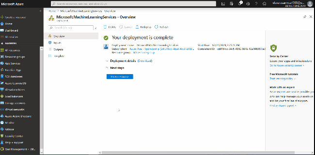
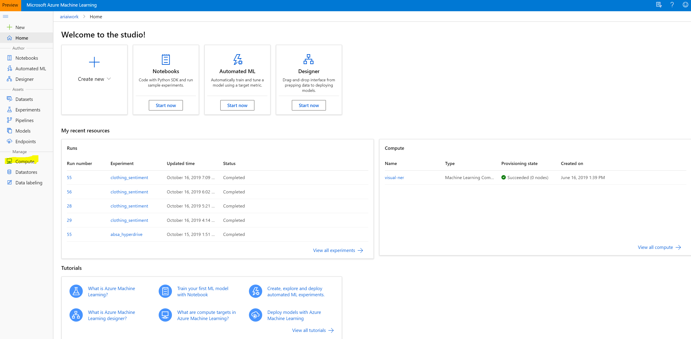
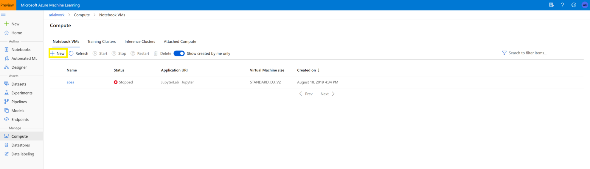
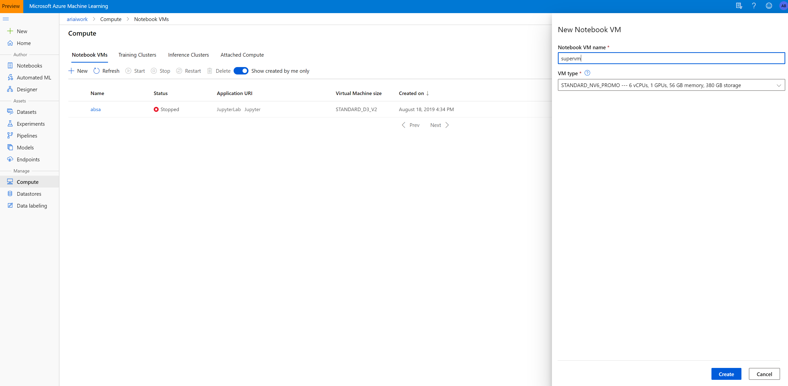
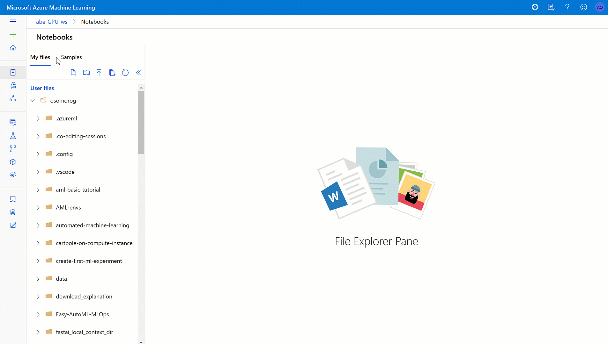

# Exploración de la visión informática en Microsoft Azure 

La visión informática es un área de la inteligencia artificial (IA) en la que los sistemas de software se diseñan para percibir el mundo visualmente, mediante cámaras, imágenes y vídeo. Hay varios tipos específicos de problemas de visión informática que los ingenieros de inteligencia artificial y los científicos de datos pueden resolver mediante una combinación de modelos de aprendizaje automático personalizados y soluciones de plataforma como servicio (PaaS), incluidos muchos servicios cognitivos en Microsoft Azure.

## Configuración del entorno de trabajo

Para este módulo haremos uso de los Jupyter Notebooks.

Los cuadernos de Jupyter son ambientes de computación interactiva que le permite al usuario hacer el reporte de alguna computación incluyendo código, gráficos, ecuaciones, imágenes, videos, entre otros. En cristiano, esto quiere decir que podemos explicar con detalle cada paso en el trabajo que estemos realizando y hacerlo ameno de leer para otras personas.

* Creamos un recurso de Machine Learning 
    * 
* Escribimos la información para configurar nuestro entorno de trabajo
    * **Workspace name:** *Nombre*
    * **Subscription:** *Seleccionamos nuestra suscripción*
    * **Resource Group:** *El nombre de nuestro grupo de recursos(folder)*
    * **Location:** *Region*
* Una vez configurado, seleccionamos **Revisar y Crear**
* Para ver el recurso, seleccione **Ir al Recurso**
* Del portal del espacio de trabajo, seleccione **Launch Studio** para ir al Azure Machine Learning Studio.
    * 

* Configuramos los clusters de cómputo
    * Navegamos a Azure ML **Compute** 
    * 
    * Clic en **New Compute**
    * 
    * Seleccionamos el tamaño de la VM y damos clic en **create**
    * 

* Creamos un nuevo cuaderno
    * 
    
Ahora tenemos listo nuestro entorno de trabajo.

## Lab 1: Análisis de imágenes con el servicio Computer Vision

El servicio Computer Vision permite a los ingenieros de software crear soluciones inteligentes que extraigan información de imágenes; tarea común en muchos escenarios de inteligencia artificial (AI).

En este laboratorio usaremos el servicio Computer Vision en Azure para identificar elementos reales basados en imágenes.

### Instrucciones

1.  Abra el cuaderno [**01 - Image Analysis with Computer Vision.ipynb**](../notebooks/01 - Image Analysis with Computer Vision.ipynb) en su entorno de trabajo. 
    
2.  Siga las instrucciones del cuaderno para completar el laboratorio.

## Lab 2: Clasificación de imágenes con el servicio Custom Vision

La clasificación de imágenes es una carga de trabajo habitual en las aplicaciones de inteligencia artificial (IA). Aprovecha la eficacia predictiva del aprendizaje automático para permitir que los sistemas de inteligencia artificial identifiquen elementos reales en función de imágenes.

En este laboratorio usaremos el servicio Custom Vision en Azure para identificar un elementos real en una imagen.

### Instrucciones

1.  Abra el cuaderno [**02 - Image Classification.ipynb**](../notebooks/02 - Image Classification.ipynb) en su entorno de trabajo.

2.  Siga las instrucciones del cuaderno para completar el laboratorio.

## Lab 3: Detección de objetos en imágenes con el servicio Custom Vision

La detección de objetos es una forma de visión informática en la que los agentes de inteligencia artificial (AI) pueden identificar y buscar tipos específicos de objeto en una fuente de cámara o de imagen.

En este laboratorio usaremos el servicio Custom Vision en Azure para identificar varios elementos reales en una imagen.

### Instrucciones
1.  Abra el cuaderno [**03 - Object Detection.ipynb**](../notebooks/03 - Object Detection.ipynb) en su entorno de trabajo.
    
2.  Siga las instrucciones del cuaderno para completar el laboratorio.

## Lab 4: Detección y análisis de caras con el servicio Face

La detección de caras, el análisis y el reconocimiento son una funcionalidad importante para las soluciones de inteligencia artificial (AI). El servicio cognitivo Face de Azure facilita la integración de estas funcionalidades en sus aplicaciones.

En este laboratorio usaremos el servicio Face en Azure para identificar elementos reales basados en imágenes.

### Instrucciones
1.  Abra el cuaderno [**04 - Face Analysis.ipynb**](../notebooks/04 - Face Analysis.ipynb) en su entorno de trabajo.
    
2.  Siga las instrucciones del cuaderno para completar el laboratorio.

## Lab 5: Lectura de textos con el servicio Computer Vision

El reconocimiento óptico de caracteres (OCR) hace que los sistemas de inteligencia artificial (IA) puedan leer texto en imágenes, lo que permite a las aplicaciones extraer información de fotografías, documentos digitalizados y otros orígenes de texto digitalizado.

En este laboratorio usaremos el servicio Reconocimiento óptico de caracteres en Azure para identificar el texto de cualquier imagen.

### Instrucciones

1.  Abra el cuaderno [**05 - Optical Character Recognition.ipynb**](../05 - Optical Character Recognition.ipynb) en su entorno de trabajo.

2.  Siga las instrucciones del cuaderno para completar el laboratorio.

## Lab 6: Análisis de recibos con el servicio Form Recognizer

Procesar facturas y recibos es una tarea común en muchos escenarios empresariales. Las organizaciones están migrando cada vez más a inteligencia artificial (IA) para automatizar la extracción de datos de recibos escaneados.

En este laboratorio usaremos el servicio Form Recognizer en Azure para identificar el texto de imágenes o formularios.

### Instrucciones

1.  Abra el cuaderno [**06 - Receipts with Form Recognizer.ipynb**](../06 - Receipts with Form Recognizer.ipynb) en su entorno de trabajo. 
   
2.  Siga las instrucciones del cuaderno para completar el laboratorio.