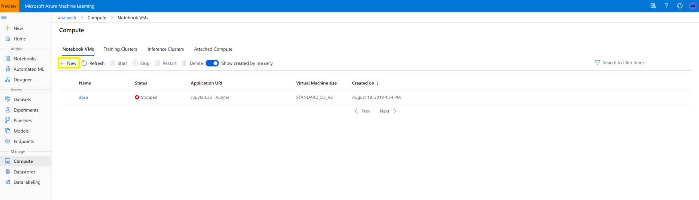

# Exploración del procesamiento de lenguaje natural

El procesamiento de lenguaje natural es compatible con aplicaciones que pueden ver y oír a los usuarios, así como hablar con ellos y entenderlos. Con el los servicios de análisis de texto, traducción y comprensión de idiomas, Microsoft Azure facilita la creación de aplicaciones compatibles con el lenguaje natural.

## Configuración del entorno de trabajo

Para este módulo haremos uso de los Jupyter Notebooks.

Los cuadernos de Jupyter son ambientes de computación interactiva que le permite al usuario hacer el reporte de alguna computación incluyendo código, gráficos, ecuaciones, imágenes, videos, entre otros. En cristiano, esto quiere decir que podemos explicar con detalle cada paso en el trabajo que estemos realizando y hacerlo ameno de leer para otras personas.

* Creamos un recurso de Machine Learning 
    * 
* Escribimos la información para configurar nuestro entorno de trabajo
    * **Workspace name:** *Nombre*
    * **Subscription:** *Seleccionamos nuestra suscripción*
    * **Resource Group:** *El nombre de nuestro grupo de recursos(folder)*
    * **Location:** *Region*
* Una vez configurado, seleccionamos **Revisar y Crear**
* Para ver el recurso, seleccione **Ir al Recurso**
* Del portal del espacio de trabajo, seleccione **Launch Studio** para ir al Azure Machine Learning Studio.
    * 

* Configuramos los clusters de cómputo
    * Navegamos a Azure ML **Compute** 
    * 
    * Clic en **New Compute**
    * 
    * Seleccionamos el tamaño de la VM y damos clic en **create**
    * 

* Creamos un nuevo cuaderno
    * 
    
Ahora tenemos listo nuestro entorno de trabajo.

## Lab 01: Análisis de texto con el servicio Text Analytics

Text Analytics es un servicio basado en la nube que proporciona un procesamiento avanzado de idioma natural sobre texto sin formato para el análisis de opinión, la extracción de frases clave, el reconocimiento de entidades con nombre y la detección de idioma.

En este laboratorio, crearemos una aplicación que pueda comprender el lenguaje natural.

### Instrucciones

1.  Abra el cuaderno [**07 - Text Analytics.ipynb**](../notebooks/07 - Text Analytics.ipynb) en su entorno de trabajo.
    
2.  Siga las instrucciones del cuaderno para completar el laboratorio.
2.  Siga las instrucciones del cuaderno para completar el laboratorio.

## Lab 02: Reconocimiento y síntesis de voz
Aprenda a reconocer y sintetizar mensajes de voz mediante Azure Cognitive Services.

En este laboratorio, crearemos una aplicación que pueda comprender el lenguaje natural.

### Instrucciones

1.  Abra el cuaderno [**08 - Speech.ipynb**](../notebooks/08 - Speech.ipynb) en su entorno de trabajo.
    **Nota:** Es posible que se le pida que complete una breve encuesta. Seleccione **No, thanks**. Es posible que deba hacer esto más de una vez.
2.  Siga las instrucciones del cuaderno para completar el laboratorio.

## Lab 03: Traducción de texto y voz
Las funcionalidades de traducción automatizada de una solución de inteligencia artificial permiten una colaboración más estrecha, ya que eliminan las barreras de idioma.

En este laboratorio, crearemos una aplicación que pueda comprender el lenguaje natural. 

### Instrucciones

1.  Abra el cuaderno [**09 - Translation.ipynb**](../notebooks/09 - Translation.ipynb) en su entorno de trabajo. 
   
2.  Siga las instrucciones del cuaderno para completar el laboratorio.

## Lab 04: Creación de un modelo de lenguaje con Language Understanding
En este módulo, se presenta el servicio Language Understanding y se muestra cómo crear aplicaciones que entiendan lenguajes.

En este laboratorio, crearemos una aplicación que pueda comprender el lenguaje natural. 

### Instrucciones

1.  Abra el cuaderno [**10 - Language Understanding.ipynb**](../notebooks/10 - Language Understanding.ipynb) en su entorno de trabajo. 
    
2.  Siga las instrucciones del cuaderno para completar el laboratorio.